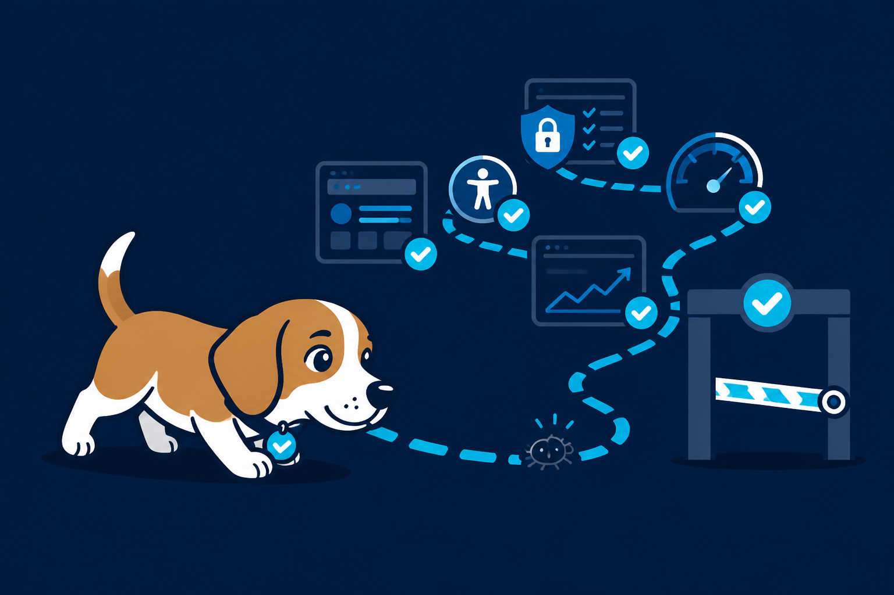

# TestBeagle

<p align="center">
  
</p>

<p align="center">
  <a href="./LICENSE"></a>
  
  
  
  
</p>

**Your friendly QA beagle: an agent-driven, plan-gated test suite that runs a project locally, sniffs out bugs across every user path, and writes an evidence-based report — the same way in Claude Code and Codex CLI.**

TestBeagle is a set of portable agent **skills**. Point any of them at a repo you can run locally (web, iOS, Android, API, or a monorepo) and the agent discovers how it runs, gets your approval on a route map, then launches it, captures every screen, exercises the flows, and reports what it found — with an explicit list of what it could *not* verify. It never invents a pass.

> Like a beagle on a scent, it works the whole trail — functional QA, security, accessibility, and performance — not just a shallow "did the build survive" smoke check.

## Skills

| Skill | What it does | Say something like |
|-------|--------------|--------------------|
| **preflight** | Foundation. Checks whether the repo can be run/tested locally: project type, toolchain, how it runs, where screenshots/media go. Run this first. | "preflight this repo", "테스트 가능한 환경인지 봐줘" |
| **bugsweep** | Full-path functional QA: screenshots/video of every screen + real interaction across all flows (signup → every feature). | "전수 QA 해줘", "screenshot every screen" |
| **breachsweep** | Security testing of an app **you own**: authz/IDOR, injection, secret exposure, headers, cookies/CORS. Local, non-destructive. | "보안 점검", "pentest my app" |
| **a11ysweep** | Accessibility & UX: contrast, tap-target size, ARIA/labels, keyboard nav, locale parity, AI UI slop. | "접근성 점검", "a11y audit" |
| **perfsweep** | Performance: Lighthouse, load time, jank, bundle size, low-power/energy use. | "성능 점검", "Lighthouse" |
| **casewright** | Turns flows and verified findings into reusable automated test cases in the repo's own test framework (e2e/integration/regression). | "테스트 케이스 만들어줘", "write test cases" |
| **scriptify** | Turns a discovered flow into a committed, repo-native static `.sh` runner so it re-runs **without an agent**. | "정적 스크립트로 만들어줘", "make a capture script" |

Every run is **plan-gated**: the agent shows you the route map and waits for approval before it launches, seeds, or captures anything. In Claude Code this uses plan mode; in Codex it posts the plan and waits for your explicit OK. Reports default to Korean and land in the repo (e.g. `docs/qa/`), reusing the project's own conventions where they exist.

## Requirements

- `git` and `bash` (all skills).
- **Web** targets: Google Chrome. Interaction/console/network capture is best with the [chrome-devtools MCP](https://github.com/ChromeDevTools/chrome-devtools-mcp); without it, skills fall back to capture-only headless Chrome.
- **iOS** targets: Xcode + `xcrun simctl` (macOS).
- **Android** targets: Android SDK platform-tools (`adb`).

> Codex CLI: to give the web driver full interaction, enable the chrome-devtools MCP in `~/.codex/config.toml` (`[mcp_servers.chrome-devtools] command="npx" args=["chrome-devtools-mcp@latest"]`). Otherwise web QA degrades to capture-only and reports the gap honestly.

## Install

Pick your runtime — all methods install the same 7 skills. Re-running is safe.

### Claude Code — plugin (recommended)

Add this repo as a plugin marketplace, then install the plugin:

```
/plugin marketplace add TestBeagle/TestBeagle
/plugin install TestBeagle@TestBeagle
```

The whole suite installs as one plugin, so the skills' shared references stay intact. (Restart Claude Code if the skills don't show up right away.)

### Codex CLI — plugin

```bash
codex plugin marketplace add TestBeagle/TestBeagle
codex plugin add TestBeagle@TestBeagle
```

Or wire it up by hand in `~/.codex/config.toml`:

```toml
[marketplaces.TestBeagle]
source = "TestBeagle/TestBeagle"
source_type = "github"

[plugins."TestBeagle@TestBeagle"]
enabled = true
```

### Any runtime — clone + `install.sh` (symlink)

Installs into Claude Code, Codex, **and** the cross-runtime `~/.agents/skills` (read by Copilot CLI, Gemini CLI, …) in one shot. Great for local development — edit the repo and every runtime sees the change, no reinstall.

```bash
git clone https://github.com/TestBeagle/TestBeagle.git
cd TestBeagle
./install.sh                     # ~/.claude, ~/.codex, ~/.agents
# or one runtime: ./install.sh ~/.claude/skills
```

It symlinks each `skills/<name>/` folder **and** the shared `skills/*.md` refs into the target dir, so every skill's `../<shared>.md` reference resolves.

### A single skill — `npx skills`

The [`skills`](https://github.com/vercel-labs/skills) CLI (which manages `~/.agents/skills`) installs individual skills:

```bash
npx skills add TestBeagle/TestBeagle              # all skills
npx skills add TestBeagle/TestBeagle -s preflight,bugsweep
```

> ⚠️ `npx skills` copies each skill folder on its own and does **not** carry the shared driver/report references with it, so a skill pulled this way loses its `../<shared>.md` content. For the full working suite use the **plugin** or **`install.sh`**; reach for `npx skills` when you want one skill standalone.

## Talking to the AI

TestBeagle skills are triggered by **what you say to your coding agent** (Claude Code, Codex, …) while it's open in the repo you want to test. Ask in plain language — English or Korean — and the agent matches your request to a skill and follows it.

| Want to… | Say something like |
|----------|--------------------|
| Check it can even be tested locally | "이 레포 테스트 가능한 환경인지 봐줘" · "preflight this repo" |
| Full QA + screenshots of every screen | "전수 QA 하고 모든 화면 캡쳐해줘" · "run a full QA pass on the web app" |
| Security check (your own app) | "보안 점검해줘" · "security-check my API" |
| Accessibility / UX | "접근성 점검해줘" · "audit accessibility" |
| Performance | "성능 점검해줘" · "run a Lighthouse pass" |
| Generate test cases | "테스트 케이스 만들어줘" · "write e2e tests for the login flow" |
| Freeze it into a re-runnable script | "정적 스크립트로 만들어줘" · "make a capture script" |

**Every run stops for your approval first.** The skill discovers how your app runs, shows you a plan — which screens/routes, what it will capture, what it can't verify, where the report goes — and waits. In Claude Code this is plan mode; in Codex it posts the plan and waits for your go-ahead. Nothing launches, installs, seeds, or captures until you approve. Reports are written in Korean by default, into the repo (e.g. `docs/qa/`), reusing the project's own conventions where they exist.

## Safety

**breachsweep** tests only apps **you own or are authorized to test**, against a **local** instance, and is **non-destructive** by default (no data deletion, no DoS, no mass requests, never production or third-party services). Reports include the minimum reproduction needed to fix an issue — not a weaponized exploit.

## License

Apache License 2.0 — see [LICENSE](./LICENSE). Copyright © 2026 Ted Lee.
